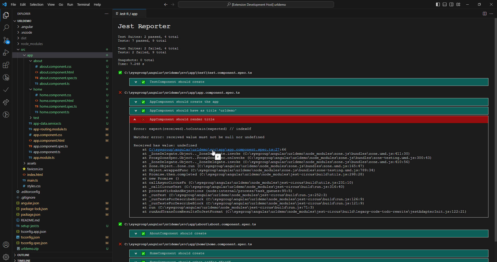
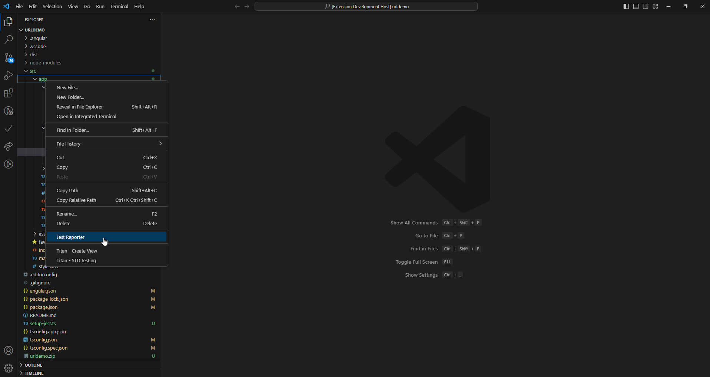
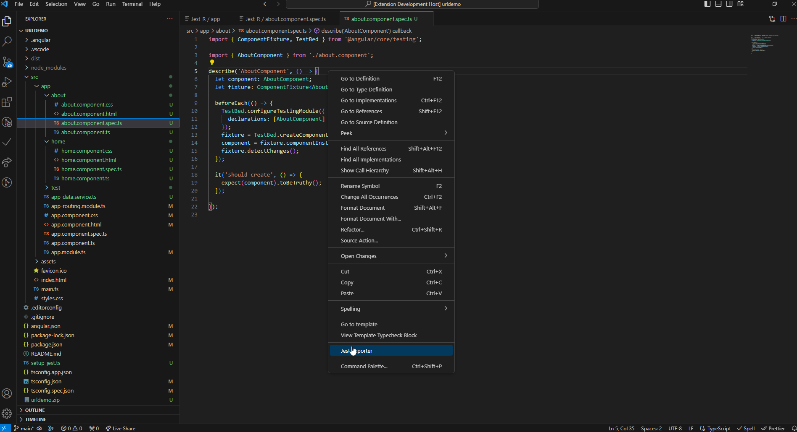

# Jest Reporter

This is the README for "Jest Reporter". Used only if you are working with the Jest local in the project.

It is running './node_modules/.bin/jest'



## Install

##Angular testing con JEST
1. Remover cualquier referencia de Jasmine / Karma en el package.json
```
npm remove '<karma karma-chrome-launcher...>'
```

2. Instalar Jest
```
npm install --save-dev jest jest-preset-angular @types/jest
```

3. Crear el setup-jest.ts en la carpeta root del proyecto y el contenido es el siguiente
```
import 'jest-preset-angular/setup-jest';
```

4. Agregar en el package.json, la configuración de Jest
```json
"jest": {
    "preset": "jest-preset-angular",
    "setupFilesAfterEnv": [
      "<rootDir>/setup-jest.ts"
    ],
    "globalSetup": "jest-preset-angular/global-setup"
  }
```

5. Configurar JEST en tsconfig.json y tsconfig.spec.json
```json
"types": [
  "jest"
]
```

6. Configurar los comandos para ejecutar las pruebas en el package.json
```json
"test": "jest",
"test:watch": "jest --watchAll",
```

7. Remover karma.config.js y el archivo test.ts


## Features

Add a menu in the explorer, it allows run the test using Jest (.spec.ts, folders). 

For example if there is selected a subfolder under your folder project you will run all test inside of subfolder:




Add a menu in file editor (.spec.ts), it allows run the test using Jest (.spec.ts, folders). 




## Release Notes


### 1.1.0

Added run test again
Added show only errors
### 1.0.2

Add images


### 1.0.1

Initial release of ...


### For more information

@autor (edwinandeka@gmail.com) 
Edwin Ramiro Ospina Ruiz


#Contact Us

* [Dowesoft](https://dowesoft.com/page/)
* [Github](https://github.com/edwinandeka)


**Thanks!**
